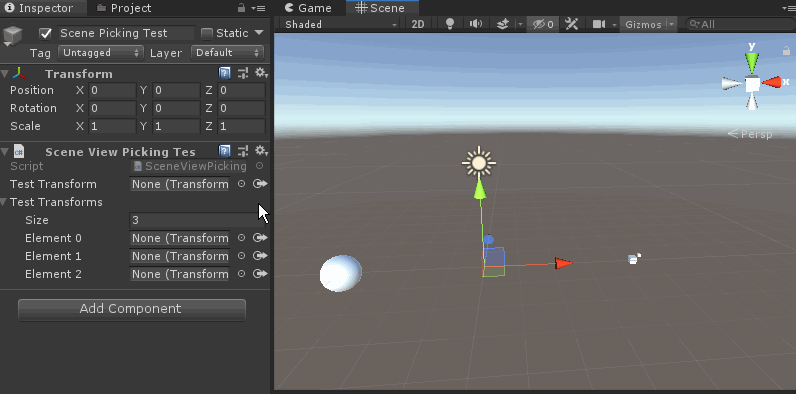

[](http://roytheunissen.com)
[](LICENSE.md)
 

_Unity extension to allow you to assign Object fields by picking it from the scene view_

## About the Project

Sometimes scene hierarchies get complex and you get in a frustrating situation where you need to assign a field and you know exactly where it is in the scene, but it's hard to point out in the hierarchy. I figured: why not make something to allow you to assign fields by pointing where the object is in the scene? That's exactly what this is.

[Video](https://youtu.be/SVsugZvvoHA)



## Getting Started

- Add the package to your Unity project (tips on how to install it are in the Installation section)
- Open a script with fields derived from Object
- Click the new button next to the hierarchy picker
  - Left Click to pick the desired object from the scene
  - Middle Click to pick from nearby objects when they are cluttered together
  - Right Click to cancel

## Extras
- If you want a callback whenever a field is assigned via picking, add the `[PickCallback("OnPicked")]` attribute
  - You can specify the name of a method to be called
  - This method can be parameterless or have two parameters of the same type of the field
  - In the latter case, the previous and current value are provided

## Installation

### OpenUPM
The package is available on the [openupm registry](https://openupm.com). It's recommended to install it via [openupm-cli](https://github.com/openupm/openupm-cli).

```
openupm add com.roytheunissen.sceneviewpicker
```

### Manifest
You can also install via git URL by adding this entry in your **manifest.json**
```
"com.roytheunissen.sceneviewpicker": "https://github.com/RoyTheunissen/Scene-View-Picker.git"
```

### Unity Package Manager
```
from Window->Package Manager, click on the + sign and Add from git: https://github.com/RoyTheunissen/Scene-View-Picker.git
```


## Contact
[Roy Theunissen](https://roytheunissen.com)

[roy.theunissen@live.nl](mailto:roy.theunissen@live.nl)
